# 基于Java的外卖商城小程序


#### 介绍
```
本系统后台系统主要使用Java语言
后台整体架构采用：SpringBoot + MyBatisPlus + MySQL数据库
前台整体架构才用：uniapp + Vue
```


项目设计为B/S架构 + 小程序客户端，

后台功能包括了：用户管理、骑手管理、商品类型管理、商品管理、后台订单管理、小程序订单管理、销售数据统计、数据图表展示、管理员账号管理。等

小程序功能包括了：搜索商品、商品列表、类型筛选、购物车功能、下单功能、地址管理、骑手申请、骑手接单、骑手订单状态流转。等


#### 系统技术栈

后台：SpringBoot + MyBatisPlus + Thymeleaf+ Layui + PearAdmin + jQuery + JavaScript +  MySQL 

小程序端：uniapp + Vue


#### 项目截图

##### 管理员端截图

| 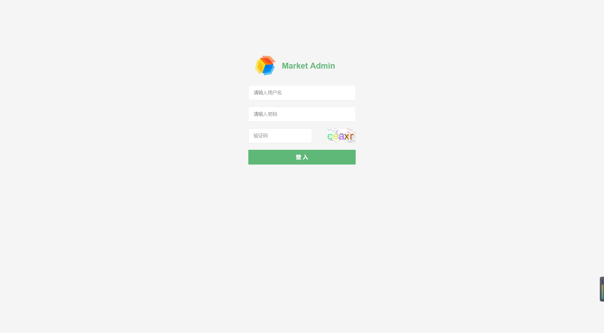 | 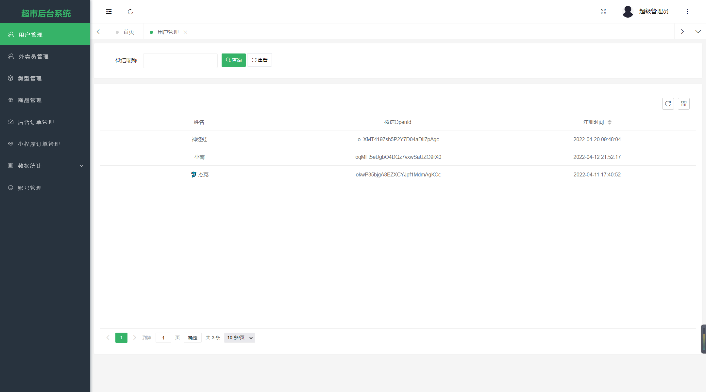 |
| ----------------------------------------------- | ----------------------------------------------- |
| 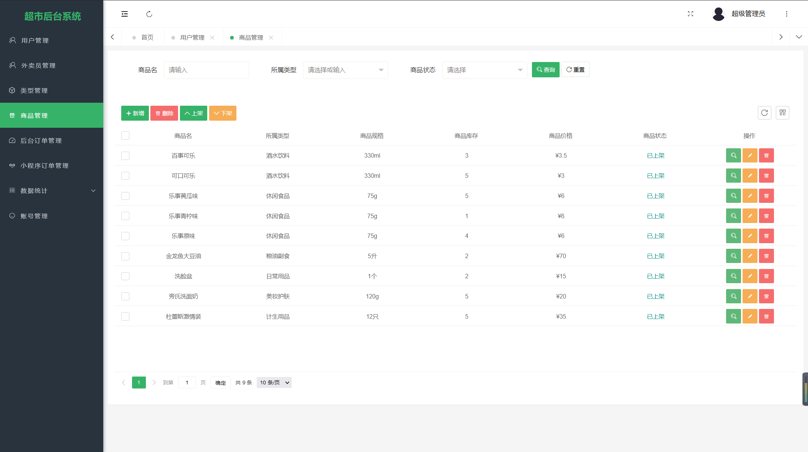 | 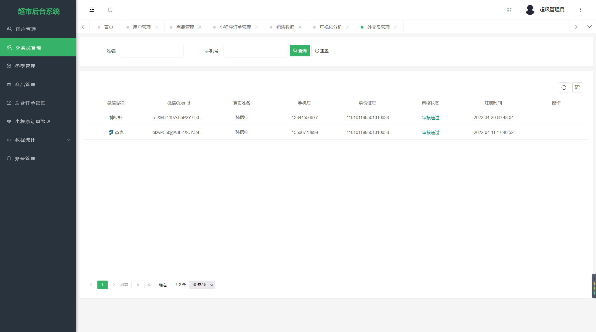 |
| 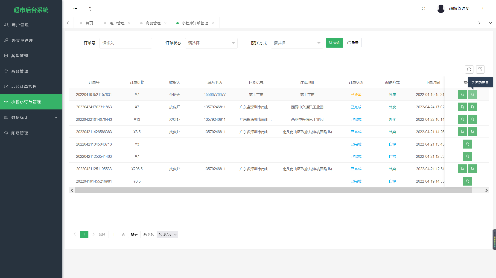 | 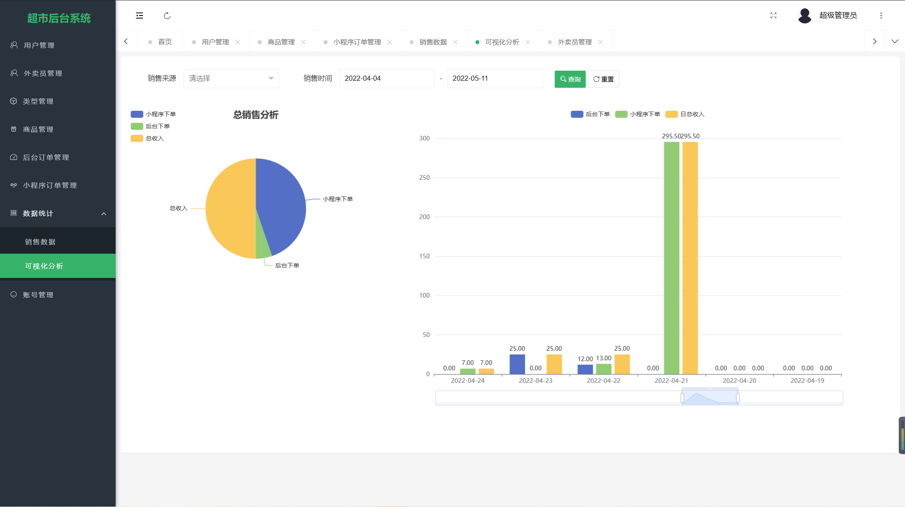 |


##### 小程序端截图

| 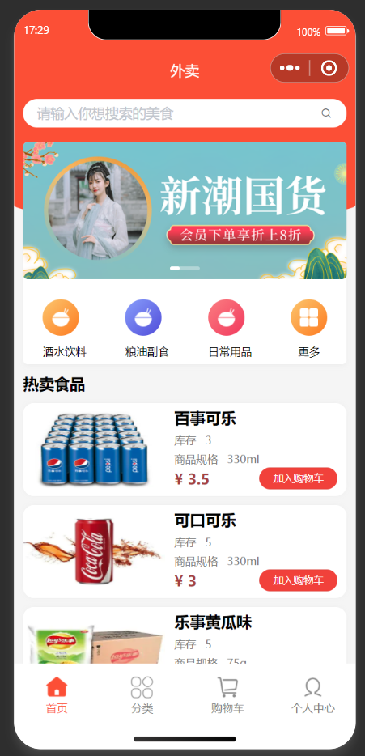 | 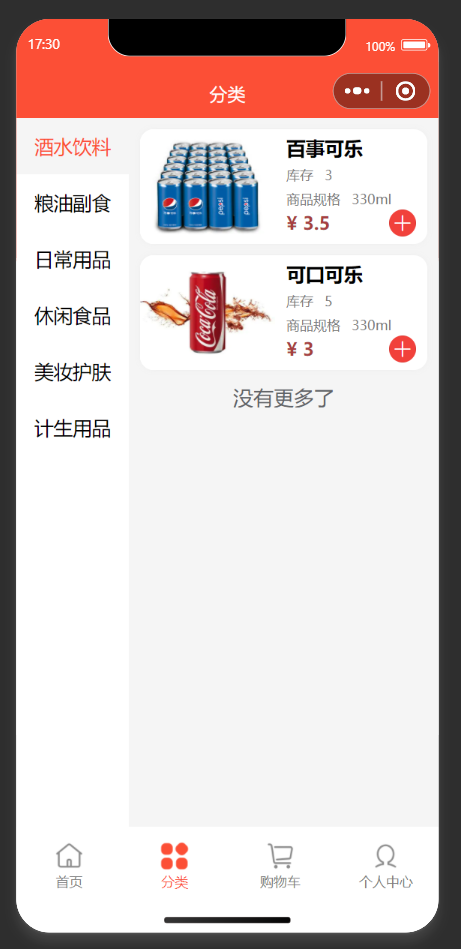 |
| --------------------------------------------- | --------------------------------------------- |
|  | 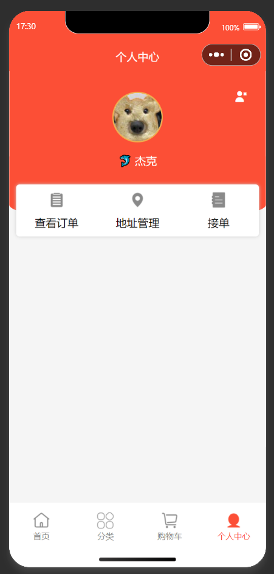 |
| 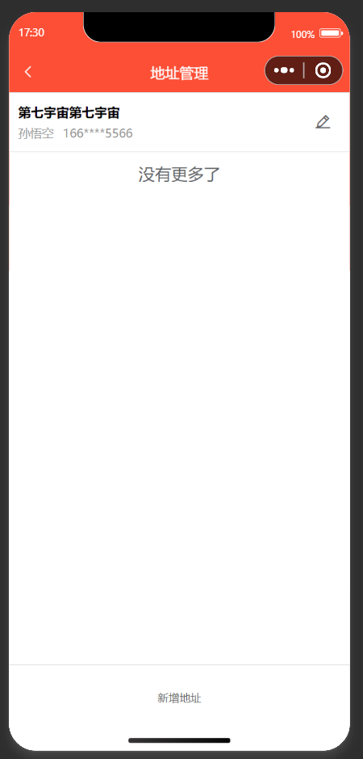 | 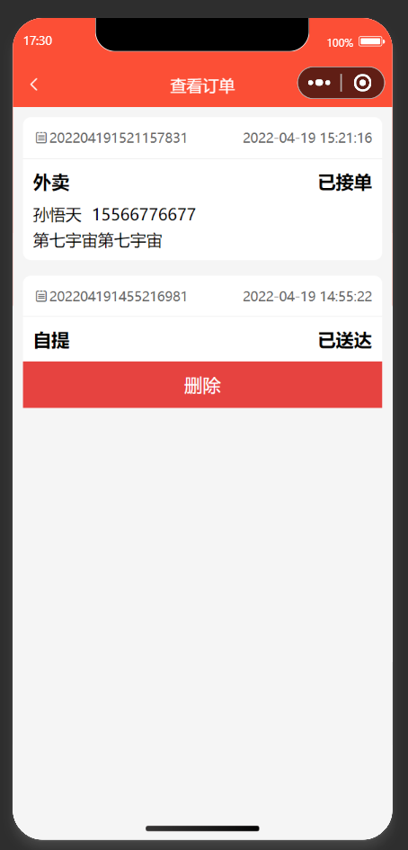 |


#### 参与贡献

1.  斗佛